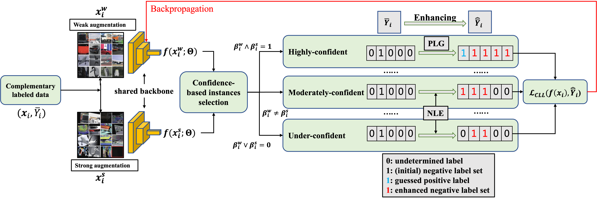

# [ICLR'25] Complementary Label Learning with Positive Label Guessing and Negative Label Enhancement

[[paper](https://openreview.net/pdf?id=LPRxGZ7Oax)], [[poster](https://drive.google.com/file/d/11QTlnGKqwcOqqGo2wiwedY-RpVSQaS9e/view?usp=sharing)], [[video(coming soon...)]()]

This repository is the official PyTorch implementation for the **ICLR 2025** paper "Complementary Label Learning with Positive Label Guessing and Negative Label Enhancements". This repository includes several baseline methods in CLL.

<b>Title</b>: <i>Complementary Label Learning with Positive Label Guessing and Negative Label Enhancement</i>

<b>Illustration</b>
<p align="center">
  
</p>

## Contents
- [PLNL](#Complementary-Label-Learning-with-Positive-Label-Guessing-and-Negative-Label-Enhancement)
  - [1. Abstract](#1-abstract)
  - [2. Requirements](#2-requirements)
  - [3. Experiments with PLNL](#3-experiments-with-plnl)
  - [4. Citation](#4-citation)
  - [5. Reference](#5-reference)
  - [6. Contact](#6-contact)

## 1. Abstract

Complementary label learning (CLL) is a weakly supervised learning paradigm that constructs a multi-class classifier only with complementary labels, specifying classes that the instance does not belong to. We reformulate CLL as an inverse problem that infers the full label information from the output space information. To be specific, we propose to split the inverse problem into two subtasks: positive label guessing (PLG) and negative label enhancement (NLE), collectively called PLNL. Specifically, we use well-designed criteria for evaluating the confidence of the model output, accordingly divide the training instances into three categories: highly-confident, moderately-confident and under-confident. For highly-confident instances, we perform PLG to assign them pseudo labels for supervised training. For moderately-confident and under-confident instances, we perform NLE by enhancing their complementary label set at different levels and train them with the augmented complementary labels iteratively. In addition, we unify PLG and NLE into a consistent framework, in which we can view all the pseudo-labeling-based methods from the perspective of negative label recovery. We prove that the error rates of both PLG and NLE are upper bounded, and based on that we can construct a classifier consistent with that learned by clean full labels. Extensive experiments demonstrate the superiority of PLNL over the state-of-the-art CLL methods, e.g., on STL-10, we increase the classification accuracy from 34.96% to 55.25%. The source code is available at https://github.com/yhli-ml/PLNL.

## 2. Requirements
The code requires `python>=3.7` and the following packages.
```
numpy==1.24
torch==1.13.0
torchvision==0.14.0
faiss==1.7.4
scikit-learn=1.3.0
```
These packages can be installed directly by running the following command:
```
pip install -r requirements.txt
```
Note that all the experiments are conducted under one single <b>RTX 4090</b>, so the results may be a little different with the original paper when you use a different gpu.

## 3. Experiments with PLNL

### 3.1 Datasets

This code includes eight datasets including:
CIFAR-10, CIFAR-100, Tiny-ImageNet, Fashion-MNIST, STL-10, SVHN, CLCIFAR-10 and CLCIFAR-20.

|Datasets|Download links|
| --------- | ---- |
|CIFAR-10|[link](http://www.cs.toronto.edu/~kriz/cifar-10-python.tar.gz)|
|CIFAR-100|[link](http://www.cs.toronto.edu/~kriz/cifar-100-python.tar.gz)|
|Tiny-ImageNet|[link](http://cs231n.stanford.edu/tiny-imagenet-200.zip)|
|Fashion-MNIST|[link](https://github.com/zalandoresearch/fashion-mnist)|
|STL-10|[link](https://cs.stanford.edu/~acoates/stl10/)|
|SVHN|[link](http://ufldl.stanford.edu/housenumbers/)|
|CLCIFAR-10|[link](https://github.com/ntucllab/CLImage_Dataset/blob/main)|
|CLCIFAR-20|[link](https://github.com/ntucllab/CLImage_Dataset/blob/main)|

If you want to run one of the datasets, please <span style="color:#0099be">download it into your data directory and change the dataset path in python scripts (see the following section)</span>.

### 3.3 Directory settings
Please create the data directories as below and change the parameter `data-dir` in ([./main.py](./main.py)).
```
PLNL
├── data-dir
│   ├── cifar-10-batches-py
│   │   ├── data_batch_1
│   │   ├── data_batch_2
│   │   ├── data_batch_3
│   │   ├── data_batch_4
│   │   ├── data_batch_5
│   │   ├── batches.meta
│   │   └── test_batch
│   ├── cifar-100-python
│   │   ├── file.txt~
│   │   ├── meta
│   │   ├── test
│   │   └── train
│   ├── cifar-100-python.tar.gz
│   ├── cifar-10-python.tar.gz
│   ...
├── plnl.py
...
```

### 3.2 Reproduce the results of PLNL
In order to reproduce the results of PLNL, you need to change the hyper-parameters in the bash scripts ([./run.sh](./run.sh)) as follows.

```bash
#!/bin/bash

methods="plnl"
data_dir="/nas/datasets"
datasets="stl10"
distrs=0
nc=1

k=250
t=0.1

gpu=0
seed=999

for method in "${methods[@]}"; do
    for dataset in "${datasets[@]}"; do
        for distr in "${distrs[@]}"; do
            file_path="./results/${method}_${dataset}_${distr}_${nc}_${k}_${t}_${seed}.log"
            log_dir=$(dirname "${file_path}")
            mkdir -p "${log_dir}"
            nohup python -u ${method}.py -dataset ${dataset} -data-dir ${data_dir}\
            -distr ${distr} -nc ${nc} -k ${k} -t ${t} \
            -gpu ${gpu} -seed ${seed} > ${file_path} 2>&1 &
        done
        if [ $gpu -eq 7 ]; then
            ((gpu=0))
        else
            ((gpu++))
        fi
    done
done
```
For example, the above provides how to run the results of PLNL on STL-10 with single complementary label, please change the `data_dir` as yours and run the following command:
```shell
cd PLNL
bash ./experiment/run.sh
```

## 4. Citation
If you find our work useful for your research, please use the following BibTeX entry. Thank you very much!
```
@inproceedings{
  li2025complementary,
  title={Complementary Label Learning with Positive Label Guessing and Negative Label Enhancement},
  author={Yuhang Li and Zhuying Li and Yuheng Jia},
  booktitle={The Thirteenth International Conference on Learning Representations},
  year={2025},
}
```

## 5. Reference
This codebase refers to DISC[[link](https://github.com/JackYFL/DISC)], POCR [[link](https://palm.seu.edu.cn/zhangml/files/POCR.zip)], PC/Forward/Free/NN/GA [[link](https://github.com/takashiishida/comp)], thank you!

## 6. Contacts
If you have any further questions, please feel free to send an e-mail to: yuhangli@seu.edu.cn.

## License
This repo is licensed under MIT License.
