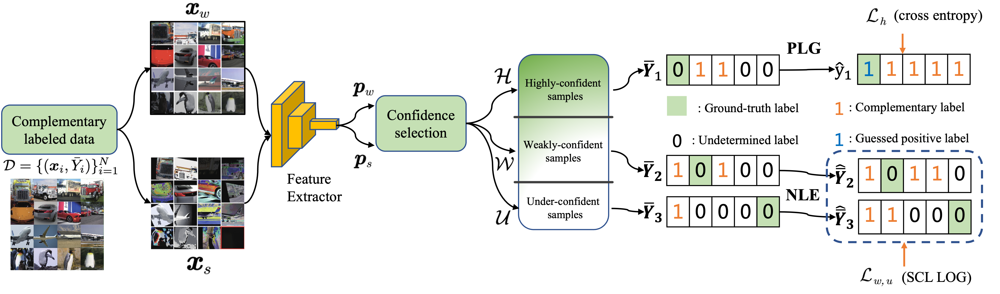

# [ICLR'25] Complementary Label Learning with Positive Label Guessing and Negative Label Enhancement
PyTorch Code for the following paper at ICLR2025

<b>Title</b>: <i>Complementary Label Learning with Positive Label Guessing and Negative Label Enhancements</i>

<b>Abstract</b>
Complementary label learning (CLL) is a weakly supervised learning paradigm that constructs a multi-class classifier only with complementary labels, specifying classes that the instance does not belong to. We reformulate CLL as an inverse problem that infers the full label information from the output space information. To be specific, we propose to split the inverse problem into two subtasks: positive label guessing (PLG) and negative label enhancement (NLE), collectively called PLNL. Specifically, we use well-designed criteria for evaluating the confidence of the model output, accordingly divide the training instances into three categories: highly-confident, moderately-confident and under-confident. For highly-confident instances, we perform PLG to assign them pseudo labels for supervised training. For moderately-confident and under-confident instances, we perform NLE by enhancing their complementary label set at different levels and train them with the augmented complementary labels iteratively. In addition, we unify PLG and NLE into a consistent framework, in which we can view all the pseudo-labeling-based methods from the perspective of negative label recovery. We prove that the error rates of both PLG and NLE are upper bounded, and based on that we can construct a classifier consistent with that learned by clean full labels. Extensive experiments demonstrate the superiority of PLNL over the state-of-the-art CLL methods, e.g., on STL-10, we increase the classification accuracy from 34.96% to 55.25%. The source code is available at https://github.com/yhli-ml/PLNL.


<b>Illustration</b>



## Requirements
- Python 3.10
- numpy 1.24
- PyTorch 1.13
- torchvision 0.14

## Prepare
To run experiments smoothly, please make the following preparations.

1. Install requirements listed above.
2. Create necessary directories.
3. ...

## Run
Tune the parameters in bash file "run.sh", and run the following prompt in terminal.

```bash
bash run.sh
```

## Cite
If you find our work useful for your research, please use the following BibTeX entry.
```
@inproceedings{li2025complementary,
  author={Yuhang Li and Zhuying Li and Yuheng Jia},
  title={Complementary Label Learning with Positive Label Guessing and Negative Label Enhancement},
  booktitle={International Conference on Learning Representations},
  year={2025}
}
```

If you have any further questions, please feel free to send an e-mail to: yuhangli@seu.edu.cn.

